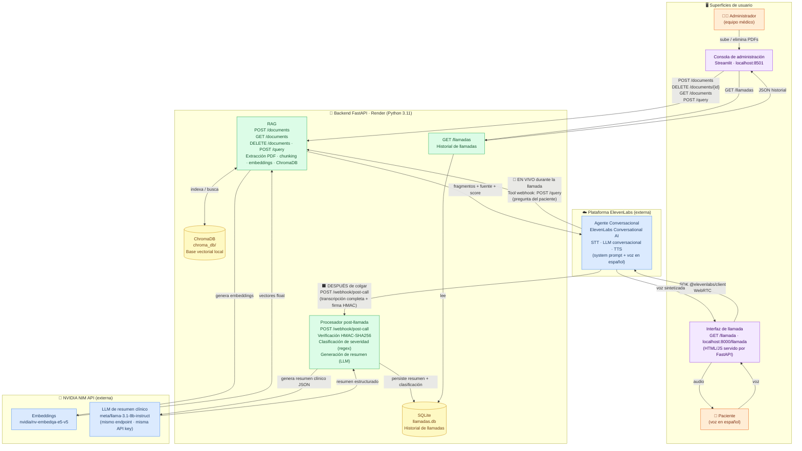

# Diagrama de Arquitectura — Agente de Voz Postoperatorio

> **Nota de despliegue:** `chroma_db/` y `llamadas.db` son locales al contenedor de Render.
> En el free tier **no persisten entre reinicios** — hay que re-subir los documentos tras cada arranque en frío.
> El agente ElevenLabs (system prompt, voz, Tool RAG, webhook) vive en el dashboard de ElevenLabs y no está en este repositorio como código.
