# Diagrama de Flujo de Decisión — Clasificación de Severidad

Lógica implementada en [`backend/webhook.py`](../backend/webhook.py).
La clasificación se aplica **únicamente sobre los turnos del paciente** (no del agente), en minúsculas.
Las reglas son deterministas (regex) — el LLM **no interviene** en la clasificación de severidad.

```mermaid
flowchart TD
    A(["📞 Llamada finalizada\nElevenLabs envía payload\nPOST /webhook/post-call"])

    A --> B{"🔐 Verificar firma\nHMAC-SHA256\nheader: elevenlabs-signature\nt=timestamp · v0=hex_hmac"}

    B -->|"❌ Firma inválida\no secret vacío\no timestamp > 30 min"| R401["🚫 HTTP 401\nRechazado\n(no se procesa)"]

    B -->|"✅ Firma válida"| C["📝 Extraer transcripción\nSolo turnos del paciente\n(role: user / patient)\nen minúsculas"]

    C --> D["🔍 Buscar patrones ROJO\n(prioridad máxima — se evalúa primero)"]

    D --> D1{"¿Sangrado abundante\no hemorragia?"}
    D1 -->|Sí| ROJO

    D1 -->|No| D2{"¿Dificultad para respirar\no falta de aire?"}
    D2 -->|Sí| ROJO

    D2 -->|No| D3{"¿Dolor de pecho\no opresión en el pecho?"}
    D3 -->|Sí| ROJO

    D3 -->|No| D4{"¿Confusión, desorientación\no 'no reconoce'?"}
    D4 -->|Sí| ROJO

    D4 -->|No| D5{"¿Desmayo, pérdida de\nconciencia o convulsión?"}
    D5 -->|Sí| ROJO

    D5 -->|No| D6{"¿Fiebre ≥ 39°C\n(menciona 39, 40 o 41 grados)?"}
    D6 -->|Sí| ROJO

    D6 -->|"No — ningún patrón ROJO"| E["🔍 Buscar patrones AMARILLO"]

    E --> E1{"¿Fiebre moderada\n37.5–38.9°C?"}
    E1 -->|Sí| AMARILLO

    E1 -->|No| E2{"¿Febrícula o\n'algo de fiebre'?"}
    E2 -->|Sí| AMARILLO

    E2 -->|No| E3{"¿Dolor en aumento\n(cada vez peor / empeorando)?"}
    E3 -->|Sí| AMARILLO

    E3 -->|No| E4{"¿Dolor 9 o 10\nsobre 10?"}
    E4 -->|Sí| AMARILLO

    E4 -->|No| E5{"¿Pus, secreción\no supuración?"}
    E5 -->|Sí| AMARILLO

    E5 -->|No| E6{"¿Herida roja, caliente\no con mal olor?"}
    E6 -->|Sí| AMARILLO

    E6 -->|No| E7{"¿Vómitos o náuseas\npersistentes?"}
    E7 -->|Sí| AMARILLO

    E7 -->|No| E8{"¿No puede levantarse,\ncaminar ni moverse?"}
    E8 -->|Sí| AMARILLO

    E8 -->|"No — ningún patrón AMARILLO"| VERDE

    %% ─── NODOS TERMINALES DE CLASIFICACIÓN ───
    ROJO["🔴 ROJO\nclasificacion: rojo\nrequiere_atencion_humana: true\nrazón: primera coincidencia detectada"]
    AMARILLO["🟡 AMARILLO\nclasificacion: amarillo\nrequiere_atencion_humana: true\nrazón: primera coincidencia detectada"]
    VERDE["🟢 VERDE\nclasificacion: verde\nrequiere_atencion_humana: false\nrazón: sin señales de alarma en transcripción"]

    %% ─── FLUJO POST-CLASIFICACIÓN ───
    ROJO --> F
    AMARILLO --> F
    VERDE --> F

    F["🤖 Generar resumen clínico\nvía LLM (meta/llama-3.1-8b-instruct · NVIDIA NIM)\nJSON con síntomas: dolor · fiebre · herida\nmovilidad · apetito · sueño + resumen narrativo\n(2 intentos; si falla → error_procesamiento)"]

    F --> G["💾 Persistir en SQLite\nllamadas.db\ncampos: conversation_id · paciente_id\nfecha · clasificacion · razon\nrequiere_atencion_humana · duracion_segundos\nsintomas_reportados · resumen_narrativo"]

    G --> H["📊 Visible en Consola\nGET /llamadas → Streamlit\nemoji 🟢/🟡/🔴 + resumen expandible"]

    %% ─── ESTILOS ───
    classDef rojo fill:#fee2e2,stroke:#dc2626,color:#7f1d1d,font-weight:bold
    classDef amarillo fill:#fef9c3,stroke:#ca8a04,color:#713f12,font-weight:bold
    classDef verde fill:#dcfce7,stroke:#16a34a,color:#14532d,font-weight:bold
    classDef proceso fill:#f1f5f9,stroke:#64748b,color:#1e293b
    classDef rechazo fill:#f3f4f6,stroke:#9ca3af,color:#6b7280

    class ROJO rojo
    class AMARILLO amarillo
    class VERDE verde
    class A,C,D,E,F,G,H proceso
    class R401 rechazo
```

## Notas sobre la implementación real

| Aspecto | Detalle |
|---|---|
| **Evaluación** | Los patrones ROJO se evalúan **primero y en orden**. La primera coincidencia termina la búsqueda (no hay score acumulado). |
| **Texto evaluado** | Solo los turnos del paciente (`role: user` o `role: patient`), concatenados en minúsculas. Los turnos del agente se ignoran. |
| **Fiebre con patrón numérico** | El patrón ROJO requiere que el número (39, 40 o 41) aparezca junto a "grados" o "°" en el mismo fragmento de texto. Fiebre mencionada sin cifra exacta puede caer en AMARILLO si coincide con "algo de fiebre" o "febrícula". |
| **Clasificación ≠ LLM** | La clasificación verde/amarillo/rojo es determinista (regex puro). El LLM (`meta/llama-3.1-8b-instruct`) solo genera el resumen narrativo *después* de que la clasificación ya está decidida. |
| **Sobreescritura del LLM** | Si el LLM intentara incluir una clasificación en su JSON, el código la ignora: los campos `clasificacion`, `razon_clasificacion` y `requiere_atencion_humana` se toman exclusivamente del resultado de `clasificar_severidad()`. |
